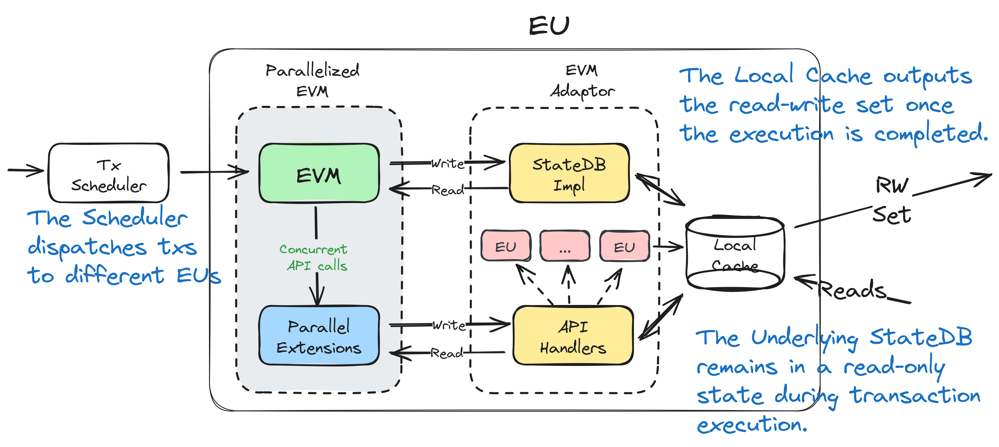

<h1> eu    </h1>

The EU project introduces an Abstract Execution Unit that serves as a transaction processing unit on the Arcology network. This module is designed to be VM-agnostic, providing a versatile solution for transaction processing. The module comprises two fundamental components.

- **[Parallelized EVM](https://github.com/arcology-network/concurrent-evm):** A module responsible for parallelizing the Ethereum Virtual Machine (EVM) on Arcology Network.

- **[EVM-adaptor](https://github.com/arcology-network/vm-adaptor):** A module functioning as a middleware to connect to the parallelized EVM, managing executable messages as input and producing state transitions as output.

- A local Write Cache to temporarily store data before persist them to the stateDB

<h2> Input and Output    </h2>

- **Input:** Executable messages from either the executor module or the Multiprocessor API calls.

- **Output:** State transitions generated as output from the EVM-adaptor module.

<h2> Nested EUs    </h2>

As mentioned in the evm-adaptor project, it is possible to start a new EVM within another. The consequence is that nesting EVMs becomes possible. 

The Multiprocessor module handles the EVM instances manually initiated using the the [concurrent API](https://github.com/arcology-network/concurrentlib). Once called, the hosting VM will initiates a `Multiprocessor` and specifying the maximum level of parallelism it can expect. The child EVMs will be terminated when all executions are completed.

The child EVMs have their own storage snapshots and no access to each other's data during execution. The state changes will be merged back into the parent EVM when the execution is finally done, and the child EVMs will be destroyed. The hosting EVM is responsible for **deterministically** merging children's snapshots together.

### Max Depth

* The maximum level for nested EVMs is 4; anything attempt to go beyong that will result in execution revert together with all the EVM above it.

### Max EVM Instances

* There is no theoretical limit on how many EVM instances can run simultaneously. However, for practical reasons and to maintain memory usage within a reasonable range, there is a maximum of 2048 EVM instances on a single physical machine. Cluster deployments do not have this limit.

<h2> Usage    </h2>

For details on how to integrate and use the EU project's Multiprocessor module, refer to the documentation.
Feel free to contribute and report issues in the GitHub repository.

<h2> License    </h2>
This project is licensed under the MIT License.