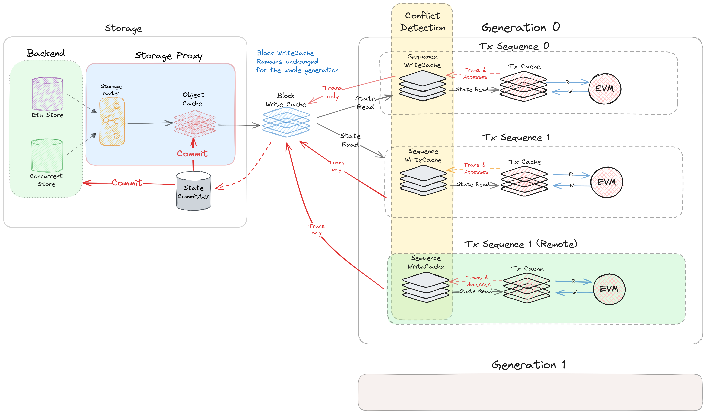

# Write Cache
- [Write Cache](#write-cache)
  - [1. Introduction](#1-introduction)
  - [2. Hierachy](#2-hierachy)
    - [2.1. Block Cache](#21-block-cache)
    - [2.2. Sequence Cache](#22-sequence-cache)
    - [2.3. Transaction Cache](#23-transaction-cache)
  - [State Commmiter](#state-commmiter)
    - [Indexer](#indexer)
  - [Deployment](#deployment)

## 1. Introduction

The write cache is a simple key-value store that holds the data that is written to the state DB. The contents of the cache are flushed to the state DB when the block is finally confirmed. The cache is implemented as a hash table that maps keys to values. The module has two major components. 
- The cache itself, which is a hash table that maps keys to values.
- An read-only data source that is used to read the data when it is not found in the cache.

The data souce is a simple interface, any data source that implements the interface can be used. This makes it possible to build a cache tree where the data source is another cache. This is useful for implementing a multi-level cache system for multi-threading execution.

## 2. Hierachy

The transactions are divided into multiple generations. Each generation has a of sequences that consists of sequential transactions. Generations are executed sequential order, meaning only when the previous generation is completed, the next generation can start. The sequences in a generation are executed in parallel. 

### 2.1. Block Cache

The block cache is the top-level cache in the system. Its read-only data source is the state DB. The block cache is committed to the state DB only when the block is confirmed.  When a new block begins, a block cache is created. The generations don't have the caches of their own, because they are executed sequentially. They use the block cache as their cache instead.

This cache is used to store the data that is written by all the generations in the concurrent blocking cycle. The block cache is committed to the state DB only when the block is confirmed. 

### 2.2. Sequence Cache

The sequences have their own caches since they are executed in parallel. The sequences use the block cache as their read-only data source. 
The sequence cache is the second-level cache in the system. Its read-only data source is the block cache. This cache is used to store the data that is written by all the transactions in a sequence. The sequence cache is merged back to the block cache when the sequence is confirmed with all the conflicting transactions removed.

When a sequence starts, a new empty cache is created, with the block cache as its read-only data source. Then the transactions are executed one by one.The sequence has all the accumulated state changes made by the transactions in the sequence.

### 2.3. Transaction Cache

The transaction cache is the third-level cache in the system. Its read-only data source is the sequence cache. This cache is used to store the data that is written by a transaction. Before a transaction is executed, a transaction cache is created by linking the sequence cache as its read-only data source. The transaction only writes to this cache. When the transaction is completed, the cache is merged back to the sequence cache, so the updated state is available for the next transaction in the sequence.

## State Commmiter

The state commmiter is a module that is responsible for committing the state changes to any storage that implements the state DB interface.

### Indexer

The state Committer mainly consists of a number of indexers that are responsible for indexing the incoming state changes. 

## Deployment