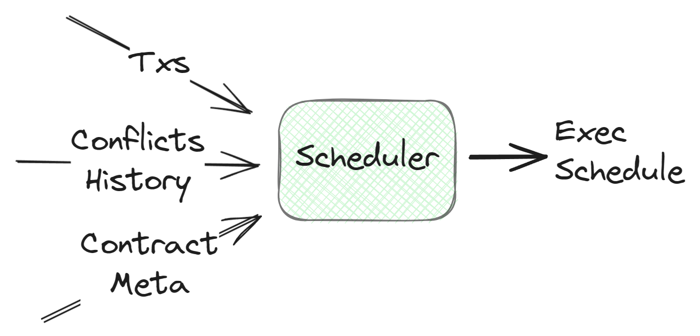
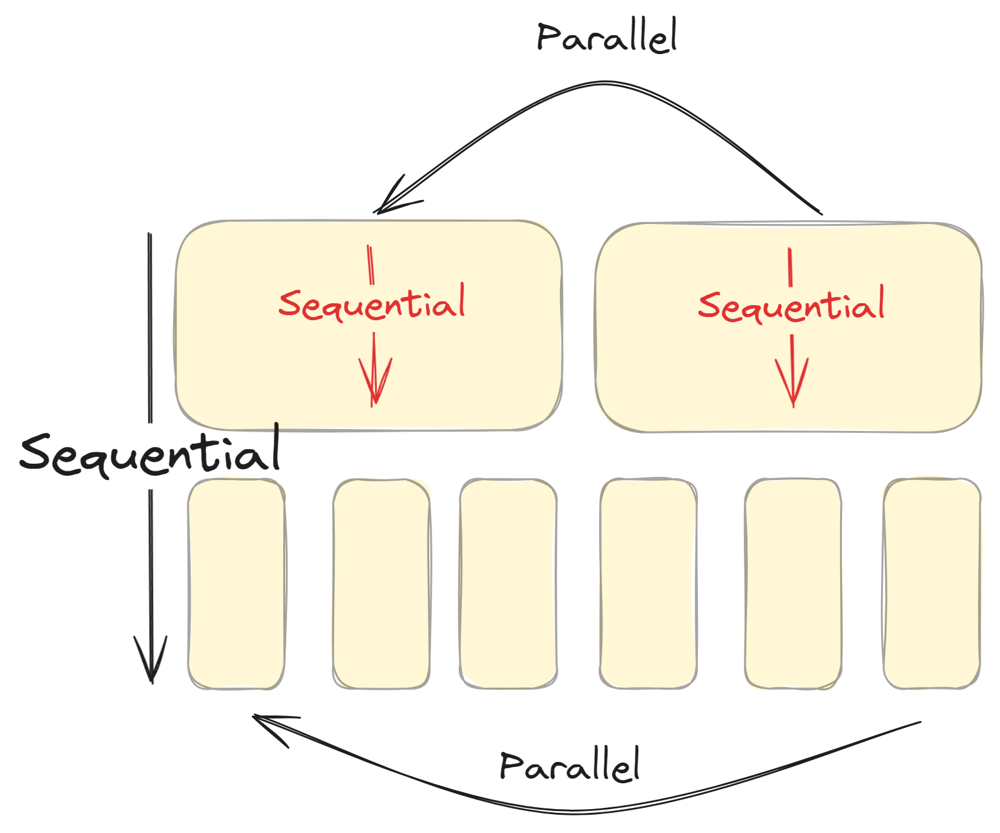

# Scheduler

The scheduler is a module responsible for creating an optimal execution schedule so that the transactions can be processed in the most efficient way possible. It is designed to take the best use of the parallel execution of the Arcology network.  

## Input $ Output

The scheduler takes a list of `StandardMessage` as input and makes a schedule based on the following information:
-  Input messages 
-  Conflict history
-  Contract meta info

## Conflict DB

The conflict db is where the scheduler stores the conflict history. It is a map of `Callee` to `Callee` where the key is the callee and the value is the callee that has a conflict with the key.

## Conflict Info

The scheduler uses the conflict info and the function meta to determine how to schedule the transactions. 

- The conflict is coming from the conflict detection module.
- The function meta is the info of the contracts provide at the deployment time.

## Callee 

Enties in the DB are named calles. Each callee is uniquely identified by a combination of the contract's address and the function signature. It keep track of the callees that have conflicts with each other in the past.

## Using the Scheduller

The Scheduler has two functions:

1. `Add(lftAddr [20]byte, lftSig [4]byte, rgtAddr [20]byte, rgtSig [4]byte)`: Add a new conflict pair to the scheduler.
This function should be called to update its internal conflict db after the detection. Duplicate pairs will be ignored.

2. `New(stdMsgs []*eucommon.StandardMessage)`: Create a schedule based on the input messages. The scheduler will return a schedule object based on:
    - The input messages
    - The conflict history and the meta info of the contracts.

### Schedule

The shedule is a 3 dimensional array. The first dimension is the generation number. The second dimension is a set of
parallel transaction arrays. These arrays are the transactions that can be executed in parallel. The third dimension is the transactions in the sequntial order.

